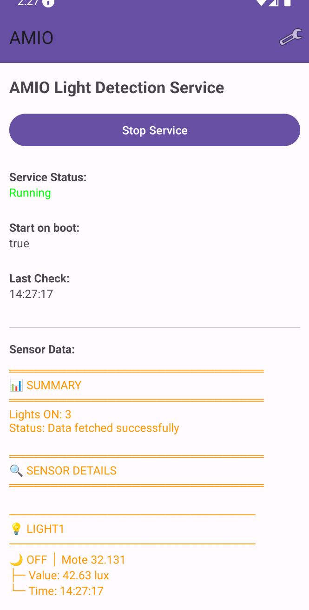
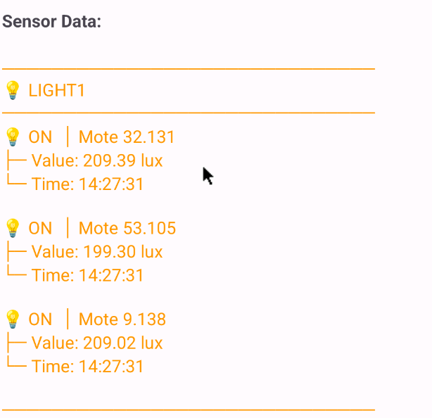
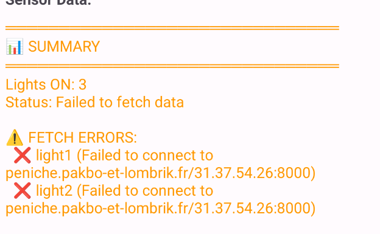
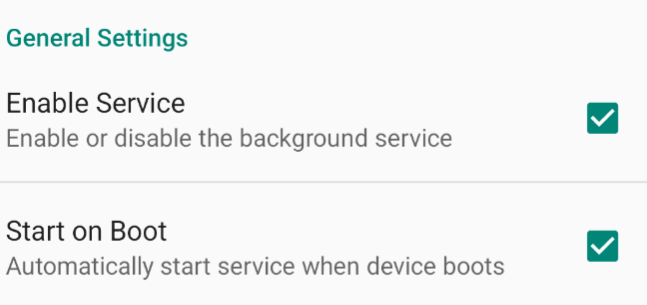
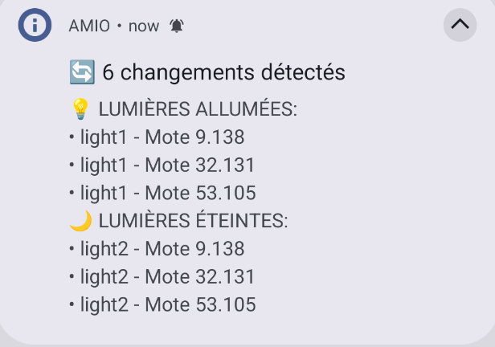
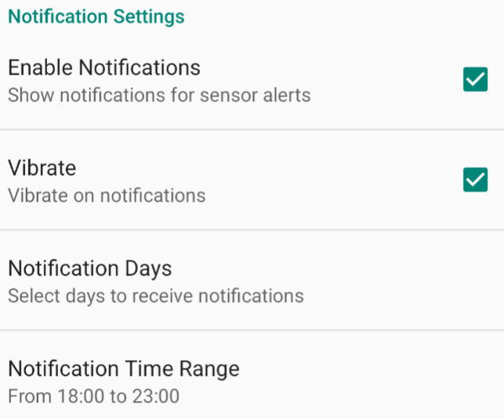
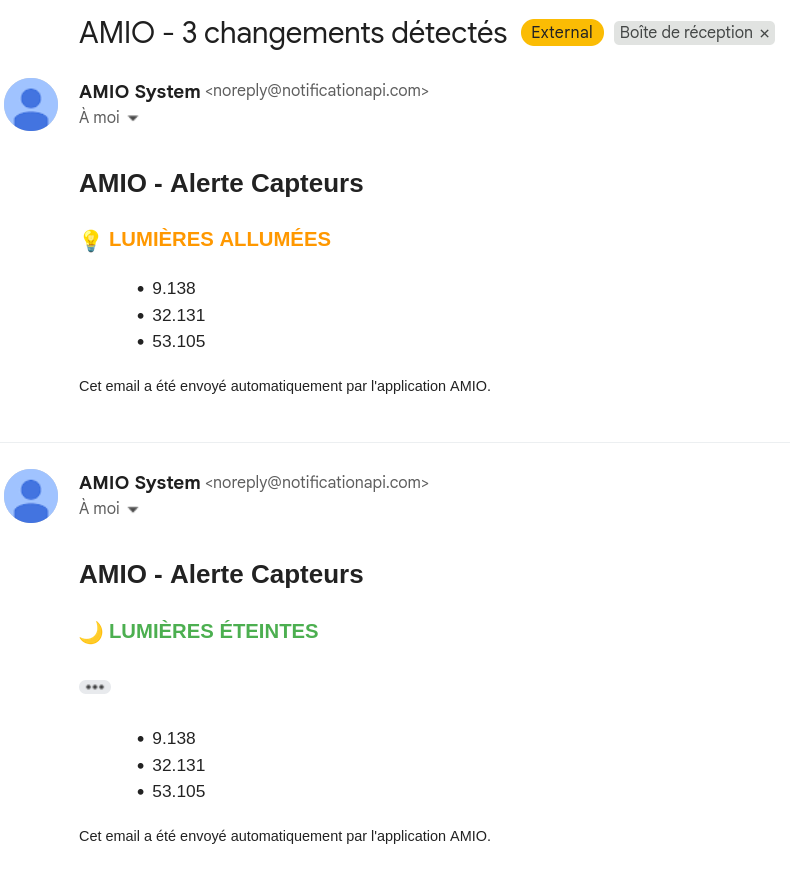
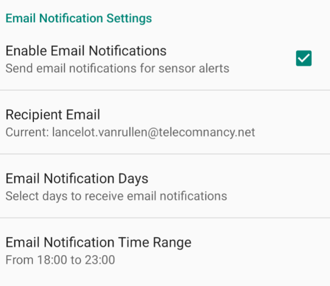
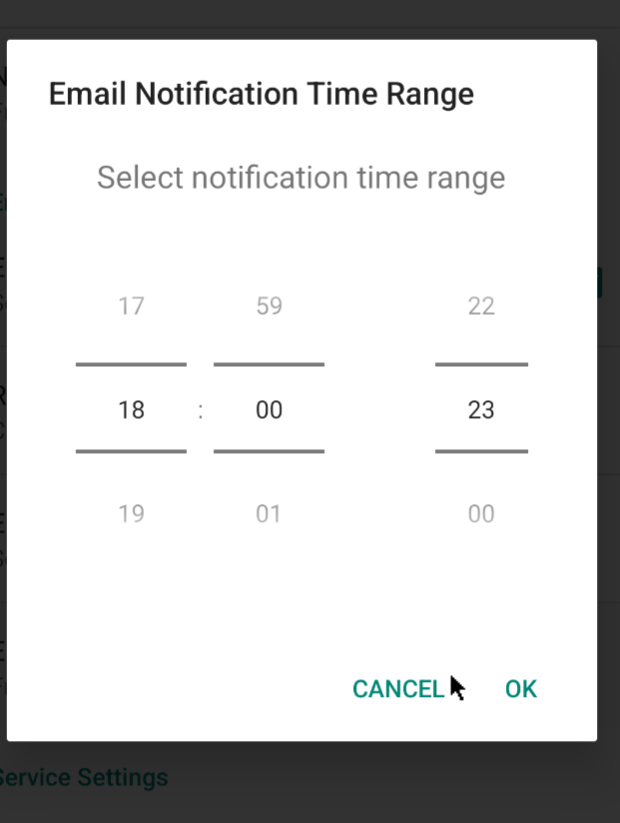
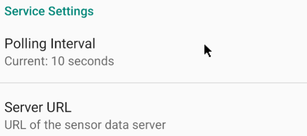

# AMIO - Application de Monitoring IoT

## Introduction

Ce projet est une application développée par **Lancelot** et **Baptiste** dans le cadre d'un projet de surveillance de capteurs IoT en temps réel.

### Objectif
L'application permet d'afficher en temps réel l'état de motes IoT (capteurs) en récupérant les données via une API REST. Elle offre un système complet de notifications (push et email) pour alerter l'utilisateur en cas de changement d'état des capteurs.

---

## Fonctionnalités Principales

### 1. Affichage en Temps Réel des Données des Capteurs

#### Description
L'application affiche en direct l'état des motes IoT récupérées depuis un serveur API. Lorsque le service est activé, l'application effectue des appels périodiques à l'API pour récupérer les données des capteurs et met à jour l'interface utilisateur en temps réel.

#### Fichiers concernés

**`MainActivity.java`**
- Classe principale de l'interface utilisateur
- Gère l'affichage des données des capteurs
- Fonctions principales :
    - `updateSensorUI()` : Met à jour l'interface avec les nouvelles données des capteurs
    - `onServiceDataReceived(SensorState state)` : Callback appelé lors de la réception de nouvelles données depuis le service
    - `toggleService()` : Démarre ou arrête le service de récupération des données

**`MainService.java`**
- Service Android qui tourne en arrière-plan
- Effectue les appels périodiques à l'API
- Fonctions principales :
    - `onCreate()` : Initialise le service et démarre la récupération périodique
    - `fetchSensorData()` : Effectue l'appel API pour récupérer les données des capteurs
    - `startPeriodicFetch()` : Configure le timer pour les appels périodiques
    - `broadcastSensorState(SensorState state)` : Diffuse les données aux composants intéressés

**`LightMoteState.java`**
- Modèle de données représentant l'état d'un capteur
- Contient les informations : `moteid`, `state`, `timestamp`
- Fonctions principales :
    - `fromJson(String json)` : Parse les données JSON de l'API
    - `toJson()` : Sérialise l'état en JSON

**`ServiceBroadcastReceiver.java`**
- Récepteur des broadcasts du service
- Permet la communication entre le service et l'activité principale
---

### 2. Page de Settings et Stockage des Données

#### Description
L'application dispose d'une page de paramètres complète permettant de configurer le comportement du service, les notifications, et les plages horaires. Les préférences utilisateur sont stockées de manière persistante.

#### Fichiers concernés

**`SettingsActivity.java`**
- Activité de gestion des paramètres
- Gère l'interface des préférences utilisateur
- Fonctions principales :
    - `onCreate()` : Initialise l'interface des préférences
    - `loadPreferencesFromSharedPreferences()` : Charge les préférences sauvegardées
    - `setupPreferenceListeners()` : Configure les listeners pour détecter les changements

**`SettingsManager.java`**
- Classe singleton pour gérer l'accès aux SharedPreferences
- Fonctions principales :
    - `getInstance(Context)` : Obtient l'instance unique du gestionnaire
    - `getString(String key, String defaultValue)` : Récupère une valeur String
    - `setString(String key, String value)` : Sauvegarde une valeur String
    - `getBoolean()`, `setBoolean()`, `getInt()`, `setInt()` : Méthodes similaires pour d'autres types

**`TimeRangePreference.java`**
- Composant personnalisé pour sélectionner une plage horaire
- Permet de définir les heures de début et de fin pour les notifications
- Fonctions principales :
    - `showTimePicker()` : Affiche un sélecteur d'heure
    - `persistString(String value)` : Sauvegarde la plage horaire au format "HH:mm-HH:mm"

**Fichier XML : `res/xml/preferences.xml`**
- Définit la structure de l'interface des paramètres
- Catégories configurables :
    - **General Settings** : Activation du service, démarrage au boot
    - **Notification Settings** : Activation, vibration, jours, plage horaire
    - **Email Settings** : Configuration des notifications par email
    - **Service Settings** : Intervalle de polling, URL du serveur

#### Stockage des données
Les données sont stockées dans les **SharedPreferences** Android, qui permettent un stockage clé-valeur persistant. Les préférences sont automatiquement sauvegardées lors de chaque modification et restaurées au lancement de l'application.

---

### 3. Notifications Push

#### Description
Le système de notifications push alerte l'utilisateur en cas de changement d'état des capteurs. Les notifications respectent les plages horaires et les jours configurés dans les paramètres.

#### Fichiers concernés

**`NotificationHelper.java`**
- Gestionnaire principal des notifications push
- Fonctions principales :
    - `sendNotification(Context, String title, String message)` : Envoie une notification système
    - `shouldSendNotification(Context)` : Vérifie si les conditions sont remplies (jour, heure, activation)
    - `isCurrentTimeInRange(String timeRange)` : Vérifie si l'heure actuelle est dans la plage définie
    - `isCurrentDaySelected(Set<String> selectedDays)` : Vérifie si le jour actuel est sélectionné
    - `createNotificationChannel(Context)` : Crée le canal de notification Android

**`MainService.java`**
- Déclenche les notifications lors de changements d'état
- Utilise `NotificationHelper.sendNotification()` après détection d'un changement

#### Intégration avec les Settings
Les notifications respectent plusieurs paramètres configurables :
- **Activation/Désactivation** : `pref_notifications_enabled_notif`
- **Vibration** : `pref_vibrate_notif`
- **Jours de notification** : `pref_notification_days_notif` (MultiSelectListPreference)
- **Plage horaire** : `pref_notification_time_range_notif` (TimeRangePreference personnalisée)

Le système vérifie automatiquement ces conditions avant d'envoyer une notification, garantissant que l'utilisateur ne soit alerté que selon ses préférences.

---

### 4. Notifications par Email

#### Description

Ce système de notification permet de notifier un utilisateur par email en cas de changement d'état des capteurs IoT. Pour cela, la partie gestion de l'envoi de mail est délégué à un serveur Python tiers, l'application ne se contente que de communiquer :
- Le mail à contacter
- Les motes allumées
- Les motes éteintes

La demande d'envoi de mail suit les mêmes modalités que les notifications push (jours, plages horaires, activation) qui seront définies à part dans les paramètres.

#### Fichiers concernés

**`EmailNotificationService.java`**
- Service dédié à l'envoi de notifications par email
-

#### Configuration dans les Settings
Une section dédiée dans les paramètres permettra de configurer :
- Activation/Désactivation des emails
- Adresse email du destinataire
- Jours de réception des emails
- Plage horaire pour les emails
- Client ID et Secret pour NotificationAPI

---

### 5. Configuration du Serveur API et MockAPI

#### Description
L'application permet de configurer dynamiquement l'URL du serveur API depuis lequel les données des capteurs sont récupérées. Cette flexibilité est essentielle pour le développement et les tests.

#### Fichiers concernés

**`SettingsActivity.java`**
- Gère la préférence `pref_server_url`
- Permet à l'utilisateur de modifier l'URL du serveur

**`MainService.java`**
- Lit l'URL configurée depuis les SharedPreferences
- Utilise cette URL pour les appels API via `SensorFetchManager`

#### MockAPI

Pour faciliter le développement et les tests sans dépendre d'un serveur IoT physique, nous avons développé une **MockAPI** qui simule le comportement de l'API réelle des capteurs.

**Caractéristiques de la MockAPI :**
- Simule les réponses JSON de l'API réelle
- Permet de tester différents scénarios (changements d'état, erreurs réseau)
- Peut être déployée localement ou sur un serveur de test

---

### 6. Start on Boot

#### Description

L'utilisateur peut activer dans les paramètres l'option qui permet de démarrer le service automatiquement au démarrage de l'appareil. Ce paramètre fonctionne même si le service est arrêté avant le redémarrage.

#### Fichiers concernés
##### `MyBootBroadcastReceiver.java`
- BroadcastReceiver qui démarre le service automatiquement au démarrage de l'appareil
- S'active si l'option "Start on Boot" est activée dans les paramètres
- Fonctions principales :
    - `onReceive()` : Détecte le broadcast `BOOT_COMPLETED` et démarre le service

##### `ServiceBroadcastCallback.java`
- Interface callback pour la communication entre composants
- Permet de notifier les changements d'état aux activités

---

## Services tiers

Le code du système web qui gère les envois de mail et le mock api est dans "service_tiers", pour lancer le système il suffit de `docker compose up` dedans.

---

## Installation et Utilisation

1. Cloner le projet
2. Ouvrir dans Android Studio
3. Synchroniser les dépendances Gradle
5. Lancer l'application sur un appareil Android

